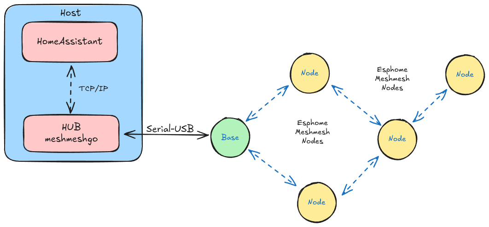

# Hub for MeshMesh network

The main task of this software is to make a bridge between the MeshMesh network and Home Assistant software 
implementing the ESPHome API standard.

The firmware for ESPHome nodes can be found on this [repository](https://github.com/EspMeshMesh/esphome-meshmesh)

## Mesh network description

MeshMesh is an implementation of a protocol for mesh communication of ESPHome nodes framework that works on ESP8266 and ESP32 based boards. The protocol is based on 802.11B frame format and is compatible with the radio equipment of chips such as ESP32 and ESP8266.

## Mesh network capabilities

MeshMesh network has the following capabilities:

* Custom 802.11B frame packet. The network is completely separated from other WiFi networks.
* Low electromagnetic pollution: The basic philosophy of the network is: "speak when spoken to", the wireless traffic is kept as low as possible.
* Multi-hop protocol, the network can use intermediate nodes to reach far nodes not in line of sight.
* ESPHome API compatibility: It can carry one or more ESPHome API connections.
* ESPHome OTA compatibility: It allows for Over the Air updates of firmware nodes from within the network.
* Home Assistant compatibility: The default ESPHome integration of a Home Assistant instance can be used to reach both the WiFi connected nodes and the MeshMesh connected nodes.
* Centralized network: The network is centralized, this makes debugging easier in case of communication problems.

Five internal protocols can be used from application to transport information:
1) Broadcast: Send a packet to all neighbors
2) Unicast: Send a packet to a specific neighbor
3) MultiHop: Send a packet to a specific node using repeaters (HOPS)
4) Polite broadcast: Send a packet to all network nodes in broadcast (Use with care)
5) Connected path: A stream socket-like connection (Used by ESPHome API for instance)

## Mesh network architecture

The above image shows the base architecture of the network, the network is centralized and is managed by a CPU (PC, Raspberry Pi, etc.). In our example the same machine we use to run the instance of Home Assistant can be used to run the HUB software (MeshMeshGo) too.

A single ESPHome/MeshMesh node is connected to the CPU using any USB to serial interface. Such a node will be called base node or coordinator.

Every other node in the network is at the same level. The network will be fully working only after the HUB has done a discovery procedure of the network forming a graph of the network connections.

The constructed graph is a directed graph in which every edge is associated with a cost that is inversely proportional to the signal strength between two nodes.

A Dijkstra algorithm is used to find the best path from one node of the network to another. This path will minimize the cost and will maximize the probability to use the best signal level to transmit packets.

The HUB will provide an interface between the IP world (Home Assistant) and the Mesh world (ESPHome). The full graph network is stored in a single xml file that can be hand edited.

## Getting started tutorial

1) [Firmware upload](docs/tutorial/firmware_build_upload.md)
2) [Getting Started](docs/tutorial/getting_started.md)
3) [No HUB communication](docs/tutorial/no_hub_commuication.md)
4) [OTA firmware upload](docs/tutorial/ota_firmware_upload.md)
