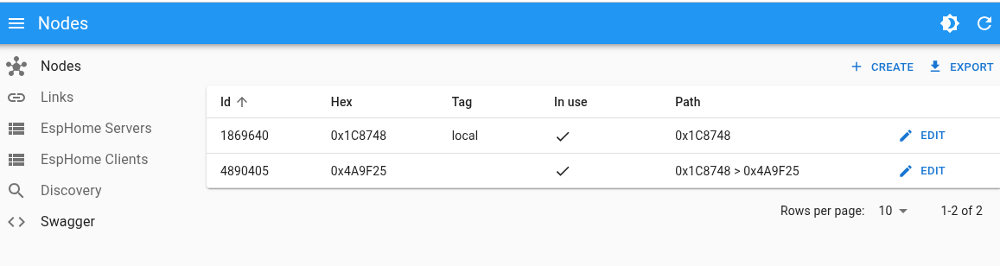
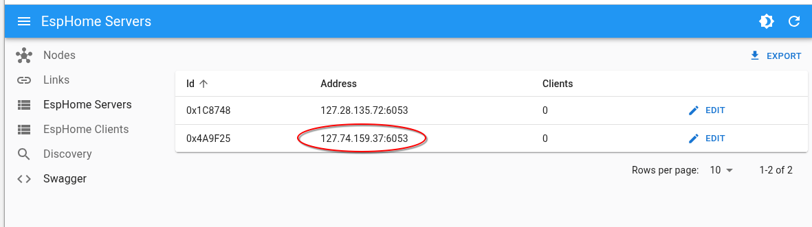

# Getting started

## BOM: List of materials

* 2 x ESP8266 compatible devices (Ex WEMOS D1 MINI)
* 1 x One Linux pc like desktop or rasberry to run 

## List of software

* MEshmesh patched  version of esphome (https://github.com/persuader72/esphome)
* Meshmeshgo software HUB for meshmesh (https://github.com/EspMeshMesh/meshmeshgo)

## Flasing node firmwares

First compile dell following config file using esphome version  patched with meshmesh network. 

Coordinator:

```yaml
esphome:
  name: coordinator

esp8266:
  board: d1_mini_lite
  framework:
    version: 3.1.2


logger:
  level: INFO
  baud_rate: 0

api:
  reboot_timeout: 0s

socket:
  implementation: meshmesh_esp8266

meshmesh:
  baud_rate: 460800
  rx_buffer_size: 2048
  tx_buffer_size: 4096
  password: !secret meshmesh_password
  channel: 3

switch:
  - platform: gpio
    pin: D4
    name: "Blue LEDS"


```

Test node #1

```yaml
preferences:
    flash_write_interval: 30sec

esphome:
  name: testnode
  
esp8266:
  board: d1_mini_lite
  restore_from_flash : True
  framework:
    version: 3.1.2

logger:
  level: VERY_VERBOSE
  baud_rate: 115200

api:
  reboot_timeout: 0s

socket:
  implementation: meshmesh_esp8266

meshmesh:
  baud_rate: 0
  rx_buffer_size: 0
  tx_buffer_size: 0
  password: !secret meshmesh_password
  channel: 3

switch:
  - platform: gpio
    pin: D4
    name: "Blue LEDS"


```

Next upload the compiled firmware on the two modules, leave the coordinator module attached to the pc using the usb and power the node module with any usb power supply.

## Discover the network

Create an empty folder called meshmesh (or any other name) and inside this folder run **meshmeshgo** executable.

Connect with [http://localhost:4002](http://localhost:4002) if all goes well you can see the following page indicating tha the coordinator node has been identified and its ID is 1869640 or 0x1C8747 (the last three bytes of the module MAC address)

 


If you check your current working folder you can see that a single file has been created, this sile is the file that describe your network. For now there is only a single node.

```xml
<graphml xmlns="http://graphml.graphdrawing.org/xmlns" xmlns:xsi="http://www.w3.org/2001/XMLSchema-instance" xsi:schemaLocation="http://graphml.graphdrawing.org/xmlns http://graphml.graphdrawing.org/xmlns/1.0/graphml.xsd">
      <desc>meshmesh network</desc>
      <key id="d0" for="node" attr.name="inuse" attr.type="boolean">
          <desc>is node in use</desc>
          <default>true</default>
      </key>
      <key id="d1" for="node" attr.name="discover" attr.type="boolean">
          <desc>state variable for discovery</desc>
          <default>false</default>
      </key>
      <key id="d2" for="node" attr.name="buggy" attr.type="boolean">
          <desc>state variable fr functional status</desc>
          <default>false</default>
      </key>
      <key id="d3" for="node" attr.name="firmware" attr.type="string">
          <desc>the node firmware revision</desc>
      </key>
      <key id="d4" for="edge" attr.name="weight" attr.type="float">
          <desc>the node firmware revision</desc>
          <default>0</default>
      </key>
      <key id="d5" for="edge" attr.name="weight2" attr.type="float">
          <desc>the node firmware revision</desc>
          <default>0</default>
      </key>
      <key id="d6" for="node" attr.name="discovered" attr.type="boolean"></key>
      <graph id="g0" edgedefault="directed">
          <desc>the graph</desc>
          <node id="0x1C8748">
              <desc>local</desc>
              <data key="d6">false</data>
              <data key="d0">true</data>
          </node>
      </graph>
  </graphml>
```

Next go to the discovery page of the admin gui [http://localhost:4002/manager/#/discoverylive](http://localhost:4002/manager/#/discoverylive)


Be sure the the test module is powered up. And launch the discovery with "Start discovery". And let run the procedure until the state is done.


Now your network is formed by two nodes



The new node has ID 4899045 or 0x4A9F25 and it can be reached with a single hop from 0x1C8748 to 0x4A9F25.

You can checkout the file *meshmesh.graphml* and now you can see the your network is constituited by two nodes and two links.

```xml
<graphml xmlns="http://graphml.graphdrawing.org/xmlns" xmlns:xsi="http://www.w3.org/2001/XMLSchema-instance" xsi:schemaLocation="http://graphml.graphdrawing.org/xmlns http://graphml.graphdrawing.org/xmlns/1.0/graphml.xsd">
      <desc>meshmesh network</desc>
      ......
      <graph id="g0" edgedefault="directed">
          <desc>the graph</desc>
          <node id="0x1C8748">
              <desc>local</desc>
              <data key="d6">true</data>
              <data key="d0">true</data>
          </node>
          <node id="0x4A9F25">
              <data key="d6">true</data>
              <data key="d0">true</data>
          </node>
          <edge id="e0" source="0x1C8748" target="0x4A9F25">
              <desc>from local:[0x1C8748] to :[0x4A9F25]</desc>
              <data key="d4">0.02</data>
          </edge>
          <edge id="e1" source="0x4A9F25" target="0x1C8748">
              <desc>from :[0x4A9F25] to local:[0x1C8748]</desc>
              <data key="d4">0.02</data>
          </edge>
      </graph>
  </graphml>
```

## Connect with Home assistant

Now let's connect the test node to our HomeAssistant instance in order to be able to control the blue led on the board using the esphome api.

First you have to find the virtual address of the discovered node. This on the meshmeshgo admin site on the servers page [http://localhost:4002/manager/#/esphomeServers](http://localhost:4002/manager/#/esphomeServers)



You cab add the device using the esphome integration in the usual way using the host and the port provided by the HUB admin page.

If this procedure is successful you have the new device configured in home assistant and you can control the blue leds.  
