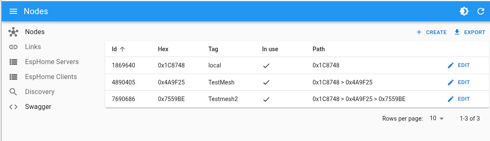

# Getting Started

## BOM: List of Materials

* 2 x **ESP8266** compatible devices (e.g., **WEMOS** D1 MINI)
* 1 x Linux PC (desktop or Raspberry Pi) to run the software

## List of Software

* **Meshmesh** patched version of **esphome** ([https://github.com/persuader72/esphome](https://github.com/persuader72/esphome))
* **Meshmeshgo** software HUB for **meshmesh** ([https://github.com/EspMeshMesh/meshmeshgo](https://github.com/EspMeshMesh/meshmeshgo))
* **Docker** container with a running **Home Assistant** instance

## Flashing Node Firmware

First, compile the following config files using the esphome version patched with meshmesh network.

### Coordinator:

```yaml
esphome:
  name: coordinator

esp8266:
  board: d1_mini_lite
  framework:
    version: 3.1.2


logger:
  level: INFO
  baud_rate: 0

api:
  reboot_timeout: 0s

socket:
  implementation: meshmesh_esp8266

meshmesh:
  baud_rate: 460800
  rx_buffer_size: 2048
  tx_buffer_size: 4096
  password: !secret meshmesh_password
  channel: 3

switch:
  - platform: gpio
    pin: D4
    name: "Blue LEDS"

mdns:
  disabled: True
```

Test node #1

```yaml
preferences:
    flash_write_interval: 30sec

esphome:
  name: testnode
  
esp8266:
  board: d1_mini_lite
  restore_from_flash : True
  framework:
    version: 3.1.2

logger:
  level: VERY_VERBOSE
  baud_rate: 115200

api:
  reboot_timeout: 0s

socket:
  implementation: meshmesh_esp8266

meshmesh:
  baud_rate: 0
  rx_buffer_size: 0
  tx_buffer_size: 0
  password: !secret meshmesh_password
  channel: 3

switch:
  - platform: gpio
    pin: D4
    name: "Blue LEDS"

mdns:
  disabled: True
```

Next, upload the compiled firmware to the two modules. Leave the coordinator module attached to the PC using USB and power the node module with any USB power supply.


## Execute the HUB (meshmeshgo) Instance
These are all the options available in the meshmeshgo HUB:

```bash
./meshmeshgo  --help
NAME:
   meshmeshgo - meshmesh hub written in go!

USAGE:
   meshmeshgo [global options] command [command options]

COMMANDS:
   help, h  Shows a list of commands or help for one command

GLOBAL OPTIONS:
   --port value                        Serial port name (default: "/dev/ttyUSB0")
   --baud value                        (default: 460800)
   --verbose, -v                       (default: false)
   --target value, -t value            (default: 0)
   --node_to_debug value, --dbg value  Debug a single node connection
   --rest_bind_address value           Bind address for the rest server (default: ":4040")
   --rpc_bind_address value            Bind address for the rpc server (default: ":50051")
   --bind_address value                Bind address for the esphome servers. Use 'dynamic' to auto-assign a port based on the node id (default: "dynamic")
   --bind_port value                   Bind port for the esphome servers. Use 0 to auto-assign a port based on the bind address (default: 6053)
   --base_port_offset value            Base port offset for the esphome servers (default: 20000)
   --size_of_ports_pool value          Size of ports pool for the server (default: 10000)
   --help, -h                          show help
```

The most important thing to start is to specify the correct serial port name associated with your coordinator device. In Linux, this might be `/dev/ttyUSB0` or `/dev/ttyACM0` or something similar.

If the serial device name is `/dev/ttyUSB0`, you can launch meshmeshgo without arguments. Otherwise, you have to specify the correct serial port name.

## Discover the Network

Create an empty folder called `meshmesh` (or any other name) and inside this folder run the **meshmeshgo** executable.

Connect to [http://localhost:4040](http://localhost:4040). If all goes well, you should see the following page indicating that the coordinator node has been identified and its ID is 1869640 or 0x1C8747 (the last three bytes of the module MAC address).

 

If you check your current working folder, you can see that a single file has been created. This file describes your network. For now, there is only a single node.

```xml
<graphml xmlns="http://graphml.graphdrawing.org/xmlns" xmlns:xsi="http://www.w3.org/2001/XMLSchema-instance" xsi:schemaLocation="http://graphml.graphdrawing.org/xmlns http://graphml.graphdrawing.org/xmlns/1.0/graphml.xsd">
      <desc>meshmesh network</desc>
      <key id="d0" for="node" attr.name="inuse" attr.type="boolean">
          <desc>is node in use</desc>
          <default>true</default>
      </key>
      <key id="d1" for="node" attr.name="discover" attr.type="boolean">
          <desc>state variable for discovery</desc>
          <default>false</default>
      </key>
      <key id="d2" for="node" attr.name="buggy" attr.type="boolean">
          <desc>state variable for functional status</desc>
          <default>false</default>
      </key>
      <key id="d3" for="node" attr.name="firmware" attr.type="string">
          <desc>the node firmware revision</desc>
      </key>
      <key id="d4" for="edge" attr.name="weight" attr.type="float">
          <desc>the node firmware revision</desc>
          <default>0</default>
      </key>
      <key id="d5" for="edge" attr.name="weight2" attr.type="float">
          <desc>the node firmware revision</desc>
          <default>0</default>
      </key>
      <key id="d6" for="node" attr.name="discovered" attr.type="boolean"></key>
      <graph id="g0" edgedefault="directed">
          <desc>the graph</desc>
          <node id="0x1C8748">
              <desc>local</desc>
              <data key="d6">false</data>
              <data key="d0">true</data>
          </node>
      </graph>
  </graphml>
```

Next, go to the discovery page of the admin GUI: [http://localhost:4040/manager/#/discoverylive](http://localhost:4040/manager/#/discoverylive)


Make sure the test module is powered up, then launch the discovery with "Start discovery" and let the procedure run until the state is "done".


Now your network consists of two nodes:


The new node has ID 4899045 or 0x4A9F25 and it can be reached with a single hop from 0x1C8748 to 0x4A9F25.

You can check the file `meshmesh.graphml` and now you can see that your network consists of two nodes and two links.

```xml
<graphml xmlns="http://graphml.graphdrawing.org/xmlns" xmlns:xsi="http://www.w3.org/2001/XMLSchema-instance" xsi:schemaLocation="http://graphml.graphdrawing.org/xmlns http://graphml.graphdrawing.org/xmlns/1.0/graphml.xsd">
      <desc>meshmesh network</desc>
      ......
      <graph id="g0" edgedefault="directed">
          <desc>the graph</desc>
          <node id="0x1C8748">
              <desc>local</desc>
              <data key="d6">true</data>
              <data key="d0">true</data>
          </node>
          <node id="0x4A9F25">
              <data key="d6">true</data>
              <data key="d0">true</data>
          </node>
          <edge id="e0" source="0x1C8748" target="0x4A9F25">
              <desc>from local:[0x1C8748] to :[0x4A9F25]</desc>
              <data key="d4">0.02</data>
          </edge>
          <edge id="e1" source="0x4A9F25" target="0x1C8748">
              <desc>from :[0x4A9F25] to local:[0x1C8748]</desc>
              <data key="d4">0.02</data>
          </edge>
      </graph>
  </graphml>
```

## Connect with Home Assistant

Now let's connect the test node to our Home Assistant instance in order to be able to control the blue LED on the board using the esphome API.

First, you have to find the virtual address of the discovered node. This can be found on the meshmeshgo admin site on the servers page: [http://localhost:4040/manager/#/esphomeServers](http://localhost:4040/manager/#/esphomeServers)


You can add the device using the esphome integration in the usual way, using the host and port provided by the HUB admin page.

If this procedure is successful, you will have the new device configured in Home Assistant and you can control the blue LEDs.

> **_Note:_** With the default arguments, the hub will bind different localhost addresses with the same port. This will require you to run the meshmeshgo executable on the same machine as the Home Assistant instance.

### Second Method

It is possible to bind all esphome servers on the same global address and use a different port for each server. This method will allow you to run the meshmeshgo instance on a different machine than the Home Assistant instance.

```bash
./meshmeshgo --bind_address 0.0.0.0 --bind_port 0
```

You can also specify which public IP you want to bind:

```bash
./meshmeshgo --bind_address 192.168.1.1 --bind_port 0
```

## Add a third node

Now is possible to add a third node to out network.

You can upload a the firmware on new node, the firmware can be based on the follwing config file.

```yaml
preferences:
    flash_write_interval: 30sec

esphome:
  name: testmesh2

esp8266:
  board: d1_mini_lite
  restore_from_flash : True
  framework:
    version: 3.1.2

logger:
  level: VERY_VERBOSE
  baud_rate: 115200

api:
  reboot_timeout: 0s

socket:
  implementation: meshmesh_esp8266

meshmesh:
  baud_rate: 0
  rx_buffer_size: 0
  tx_buffer_size: 0
  password: !secret meshmesh_password
  channel: 3

switch:
  - platform: gpio
    pin: D4
    name: "Blue LEDS"

mdns:
  disabled: True
```

Power up the new node and go to the discovery page of the admin GUI: [http://localhost:4040/manager/#/discoverylive](http://localhost:4040/manager/#/discoverylive)
than you can ise the refresh discovery action to start from currnt grpah a discover new nodes.

