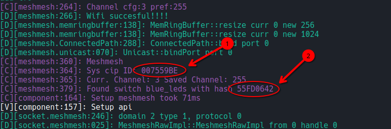

# No HUB Communication

In this tutorial, we will set up communication between two nodes without using the HUB. One node will be the controller node and will be able to control a remote switch on the controlled node. This can be useful, for instance, to control a switch from a remote node with an interrupter as a fallback method if your main network is failing.

## BOM: List of Materials

* 2 x **ESP8266** compatible devices (e.g., **WEMOS** D1 MINI)

## Flash the Controlled Node

First, we have to use the following config file and upload the firmware to the controlled node.

```yaml
external_components:
  - source: github://persuader72/esphome@mm_dev
    components: [ meshmesh, network, socket ]

preferences:
    flash_write_interval: 30sec

esphome:
  name: controlled

esp8266:
  board: d1_mini_lite
  restore_from_flash : True
  framework:
    version: 3.1.2

logger:
  level: VERY_VERBOSE
  baud_rate: 115200

api:
  reboot_timeout: 0s

ota:
  platform: meshmesh

socket:
  implementation: meshmesh_esp8266

meshmesh:
  baud_rate: 0
  rx_buffer_size: 0
  tx_buffer_size: 0
  password: !secret meshmesh_password
  channel: 3

switch:
  - platform: gpio
    pin: D4
    id: blue_leds
    name: "Blue LEDS"

mdns:
  disabled: True

```

## Flash the Controller Node

Next, we have to upload the firmware to the controller node, but before doing so, we have to find two arguments:

1. Node MAC address
2. Switch HASH number

### Method 1: No HUB Available

In case we can't make a discovery on the network, we can keep note of the MAC address (1) and Switch hash (2) from the logs we get if we upload the firmware using a USB cable.



We have to keep note of those two values and put them in the corresponding fields of the substitutions section of the following configuration file.

```yaml
external_components:
  - source: github://persuader72/esphome@mm_dev
    components: [ meshmesh, network, socket ]

preferences:
    flash_write_interval: 30sec

substitutions:
  remote_node_addr: 0x7559BE
  remote_switch_hash: 0x0642

esphome:
  name: testmesh2

esp8266:
  board: d1_mini_lite
  restore_from_flash : True
  framework:
    version: 3.1.2

logger:
  level: VERY_VERBOSE
  baud_rate: 115200

api:
  reboot_timeout: 0s

ota:
  platform: meshmesh
  
socket:
  implementation: meshmesh_esp8266

meshmesh:
  baud_rate: 0
  rx_buffer_size: 0
  tx_buffer_size: 0
  password: !secret meshmesh_password
  channel: 3

switch:
  - platform: gpio
    pin: D4
    id: my_switch
    name: "Blue LEDS"
  - platform: meshmesh
    id: remote_switch
    target: ${remote_switch_hash}
    address: ${remote_node_addr}

binary_sensor:
  - platform: gpio
    pin: D3
    name: "Control"
    on_press:
      then:
        - lambda: id(remote_switch)->toggle();

mdns:
  disabled: True

interval:
  - interval: 20sec
    then:
      - logger.log: "interval 1"
      - switch.toggle: my_switch
      - lambda: id(remote_switch)->toggle();
  - interval: 20sec
    startup_delay: 10sec
    then:
      - logger.log: "interval 2"
      - switch.toggle: my_switch
      - lambda: id(remote_switch)->toggle();
```

Next, we can build and upload the firmware to the controller node using the modified file.

## Conclusion

In the end, if all goes well, we should see that the LEDs on both nodes are toggling with a period of 10 seconds. This action is controlled by the interval component of the controller node that toggles the local and remote LEDs.

Also, the D3 pin is configured as a binary sensor. In this way, it is possible to use an interrupter to control the remote switch.

 