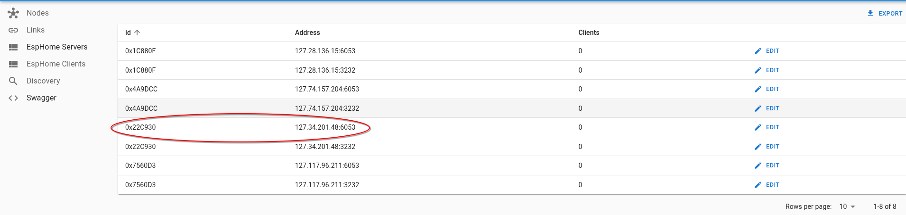

# OTA prcoedure 

Esphome OTA procedure is supported by the network. 

To upload a new firmware you have to find first the local address of the node. It can be found on the meshmeshgo HUB in the *esphome servers* page.



Next is possoble to upload the OTA in the usual esphome way using the local address-

```bash
esphome run ../esphome-configs/shelly1plus.yaml  --device 127.34.201.48 --ota-framework meshmesh
```

